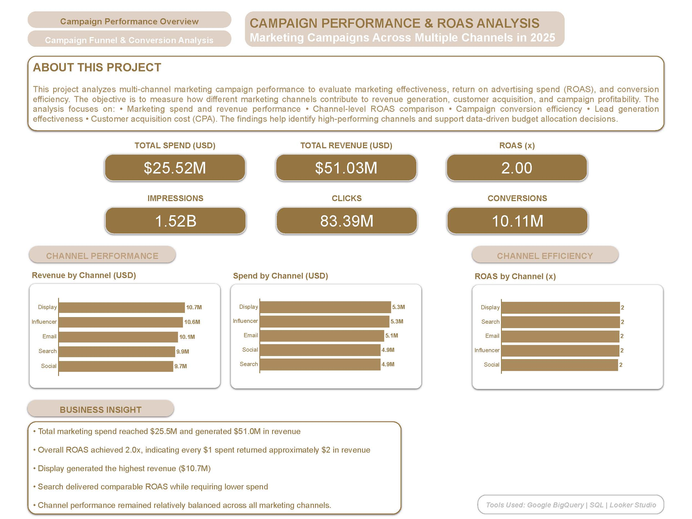
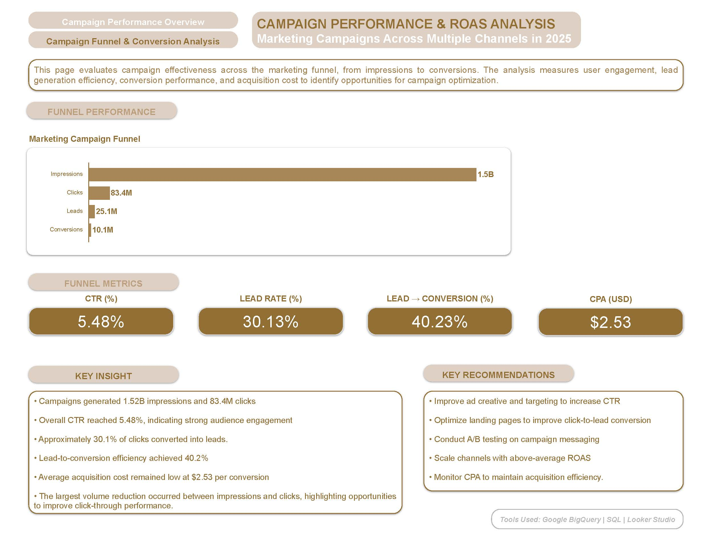

# Campaign Performance & ROAS Analysis

Marketing Analytics Portfolio Project analyzing campaign performance, ROAS, and conversion funnels using SQL, Google BigQuery, and Looker Studio.

## Project Overview

This project evaluates marketing campaign effectiveness across multiple channels by analyzing campaign spend, revenue generation, return on advertising spend (ROAS), and conversion performance.

The objective is to identify high-performing marketing channels, measure campaign profitability, and provide actionable recommendations for budget allocation and campaign optimization.

## Business Objective

The analysis aims to answer the following business questions:

* Which marketing channels generate the highest revenue?
* Which channels deliver the best return on advertising spend (ROAS)?
* How efficiently do campaigns convert users through the marketing funnel?
* What is the customer acquisition cost (CPA)?
* Where are the biggest opportunities for performance improvement?

## Tools Used

* SQL
* Google BigQuery
* Looker Studio

## Dashboard Development

### Page 1: Campaign Performance Overview

* Total Spend
* Total Revenue
* Overall ROAS
* Revenue by Channel
* Spend by Channel
* ROAS by Channel

### Page 2: Campaign Funnel & Conversion Analysis

* Marketing Funnel Performance
* CTR Analysis
* Lead Rate Analysis
* Lead-to-Conversion Analysis
* Customer Acquisition Cost (CPA)

### Dashboard Preview

The dashboard was built using Looker Studio and consists of two pages:

- Campaign Performance Overview
- Campaign Funnel & Conversion Analysis

#### Campaign Performance Overview

#### Campaign Funnel & Conversion Analysis

## Dataset

Marketing Campaign Performance Dataset Across Multiple Channels (2025)

### Dataset Source

This project uses the Marketing Campaign Performance Dataset available on Kaggle.

Dataset:
Marketing Campaign Performance Dataset

Source:
https://www.kaggle.com/datasets/mirzayasirabdullah07/marketing-campaign-performance-dataset/data

The dataset contains marketing campaign performance data across multiple channels, including impressions, clicks, leads, conversions, campaign cost, and revenue metrics used for ROAS and funnel analysis.

Note:
This project was created for educational and portfolio purposes only. All rights remain with the original dataset author.

### Dataset Fields

* Campaign ID
* Marketing Channel
* Impressions
* Clicks
* Leads
* Conversions
* Campaign Cost
* Revenue Generated
* Campaign Start Date
* Campaign End Date

## Analysis Performed

### Data Audit

* Campaign volume validation
* Channel distribution analysis
* Campaign date range validation
* Overall performance review

### Reporting Table Development

* Channel Performance Summary
* Campaign Summary
* Conversion Summary
* Executive Summary
* Funnel Summary
* Funnel Stage Summary

## Key Findings

* Total marketing spend reached approximately $25.5M
* Total revenue exceeded $51.0M
* Overall ROAS achieved 2.0x
* Campaigns generated over 10M conversions
* Search delivered competitive ROAS while requiring lower spend
* Channel performance remained relatively balanced across marketing channels

## Skills Demonstrated

- SQL Data Analysis
- Data Validation & Auditing
- Marketing Analytics
- ROAS Analysis
- Marketing Funnel Analysis
- KPI Development
- Data Modeling in BigQuery
- Looker Studio Dashboard Development
- Business Insight Generation

## Repository Structure

campaign-performance-roas-analysis

├── Dashboard

├── Documentation

├── SQL

│ ├── Data Audit

│ └── Reporting Tables

├── LICENSE

└── README.md

## Author

**Asri Ratna**

Marketing Analytics | Growth Marketing | Digital Marketing | Data Analytics

LinkedIn: https://www.linkedin.com/in/asriratna/ 

GitHub: https://github.com/asriratna-growth
